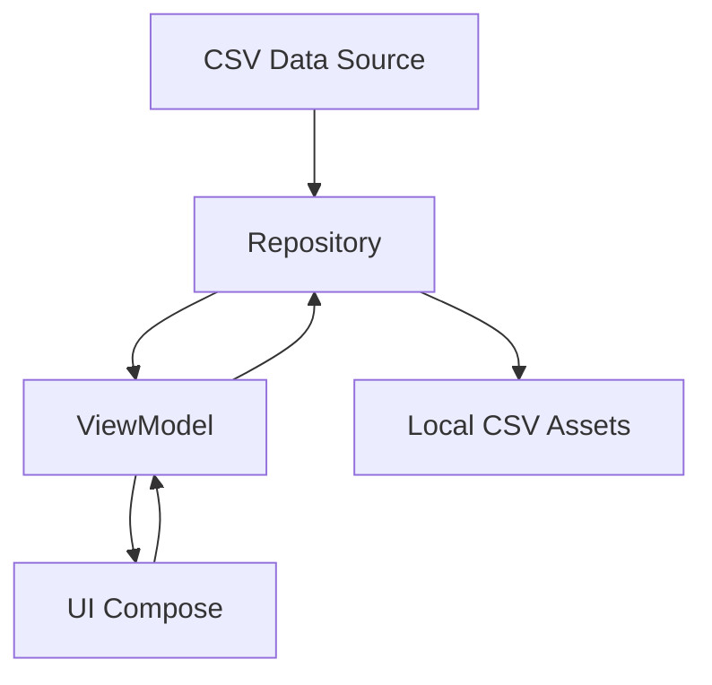

# 🚴‍♂️ GesKot - Aplicación Android de Valenbisi

<div align="center">


**GesKot** es una aplicación Android moderna desarrollada en Kotlin con Jetpack Compose que permite visualizar en tiempo real la disponibilidad de las estaciones del sistema Valenbisi en Valencia, España.

[📱 Descargar APK](#compilar-apk) • [🔧 Configuración](#configuración-e-instalación) • [📖 Documentación](#arquitectura-del-proyecto) • [🤝 Contribuir](#contribuciones)

</div>

---

## ✨ Características

### 🎯 Funcionalidades Principales
- **📊 Lista de estaciones en tiempo real**: Visualiza todas las estaciones de Valenbisi con datos actualizados
- **🎨 Colores dinámicos**: Indicadores visuales intuitivos basados en la disponibilidad:
  - 🟢 **Verde**: Alta disponibilidad (60%+ bicicletas)
  - 🟡 **Naranja**: Disponibilidad media (30-60% bicicletas)
  - 🔴 **Rojo**: Baja disponibilidad (<30% bicicletas)
- **🔍 Búsqueda inteligente**: Encuentra estaciones por nombre o dirección
- **📍 Vista detallada con mapa**: Información completa de cada estación con ubicación exacta
- **🗺️ Google Maps integrado**: Visualización interactiva de ubicaciones
- **☁️ Carga dinámica**: Descarga automática de datos CSV con respaldo local
- **🎭 Material Design 3**: Interfaz moderna, elegante y totalmente responsive

### 🔄 Características Técnicas
- **⚡ Animaciones fluidas**: Transiciones suaves entre pantallas y elementos
- **📱 Diseño adaptativo**: Optimizado para diferentes tamaños de pantalla
- **🔄 Manejo de errores**: Recuperación automática y mensajes informativos
- **🌐 Conectividad inteligente**: Funciona online y offline
- **♿ Accesibilidad**: Soporte completo para lectores de pantalla

## 📱 Pantallas de la Aplicación

| Pantalla | Descripción |
|----------|-------------|
| **🏠 Lista Principal** | Muestra todas las estaciones con indicadores de color según disponibilidad |
| **🔍 Búsqueda y Filtros** | Busca y filtra estaciones por nombre, dirección o disponibilidad |
| **📋 Detalle de Estación** | Información completa: bicis disponibles, espacios libres, estadísticas |
| **🗺️ Mapa Interactivo** | Vista de mapa con la ubicación exacta de la estación seleccionada |

## 🛠️ Stack Tecnológico

### 📱 Desarrollo Android
| Tecnología | Versión | Propósito |
|------------|---------|-----------|
| **Kotlin** | 1.9.10 | Lenguaje principal |
| **Jetpack Compose** | 1.5.4 | UI moderna y declarativa |
| **Material Design 3** | Latest | Sistema de diseño |
| **Android SDK** | API 24+ | Plataforma base |

### 🏗️ Arquitectura
| Componente | Tecnología | Descripción |
|------------|------------|-------------|
| **Patrón** | MVVM | Separación de responsabilidades |
| **Estado** | StateFlow/LiveData | Gestión reactiva del estado |
| **Navegación** | Navigation Compose | Navegación declarativa |
| **Inyección** | Manual | Gestión de dependencias |

### 🌐 Conectividad y Datos
| Librería | Versión | Función |
|----------|---------|---------|
| **OkHttp** | 4.12.0 | Cliente HTTP robusto |
| **OpenCSV** | 5.8 | Procesamiento CSV |
| **Retrofit** | 2.9.0 | API REST (opcional) |
| **Gson** | 2.9.0 | Serialización JSON |

### 🗺️ Mapas y Ubicación
| Servicio | Versión | Uso |
|----------|---------|-----|
| **Google Maps** | 18.2.0 | Mapas interactivos |
| **Maps Compose** | 4.3.0 | Integración con Compose |
| **Location Services** | 21.0.1 | Servicios de ubicación |

### ⚡ Concurrencia
| Tecnología | Propósito |
|------------|-----------|
| **Coroutines** | Operaciones asincrónicas |
| **Flow** | Programación reactiva |
| **Dispatchers** | Manejo de hilos |

## 📋 Requisitos del Sistema

### 🔧 Herramientas de Desarrollo
- **Android Studio**: Hedgehog (2023.1.1) o superior
- **JDK**: 8 o superior
- **Gradle**: 8.1.2+ (incluido en el proyecto)
- **Git**: Para control de versiones

### 📱 Dispositivo de Destino
- **Android**: 7.0 (API 24) o superior
- **RAM**: 2GB mínimo recomendado
- **Almacenamiento**: 50MB libres
- **Conexión**: Internet (opcional, con datos locales de respaldo)

### 🔑 APIs Externas (Opcionales)
- **Google Maps API Key**: Para funcionalidad completa de mapas
- **Valencia OpenData**: Fuente de datos CSV en tiempo real

## 🚀 Configuración e Instalación

### 📥 1. Obtener el Proyecto

#### Opción A: Clonar desde Git
```bash
git clone https://github.com/tu-usuario/GesKot.git
cd GesKot
```

#### Opción B: Descargar ZIP
1. Descarga el proyecto como ZIP desde GitHub
2. Extrae el archivo en tu directorio preferido
3. Navega al directorio `GesKot`

### 🗺️ 2. Configurar Google Maps API (Recomendado)

> **⚠️ Importante**: Sin esta configuración, los mapas mostrarán un marcador de posición.

#### Paso 1: Obtener la API Key
1. Ve a [Google Cloud Console](https://console.cloud.google.com/)
2. Crea un nuevo proyecto o selecciona uno existente
3. Habilita la **Maps SDK for Android**
4. Ve a **APIs & Services > Credentials**
5. Crea una **API Key** para Android
6. Restringe la clave a tu paquete de aplicación: `com.geskot.app`

#### Paso 2: Configurar la Clave
```xml
<!-- app/src/main/res/values/strings.xml -->
<string name="google_maps_key">TU_CLAVE_API_REAL_AQUI</string>
```

### 🔧 3. Configurar Android Studio

#### Abrir el Proyecto
1. **Abre Android Studio**
2. Selecciona **"Open"** o **"Open an Existing Project"**
3. Navega hasta la carpeta `GesKot` y selecciónala
4. Espera a que Android Studio importe el proyecto

#### Sincronizar Dependencias
- Android Studio sincronizará automáticamente
- Si hay problemas, ve a: **File → Sync Project with Gradle Files**
- O ejecuta: **Build → Clean Project** y luego **Build → Rebuild Project**

### ▶️ 4. Ejecutar la Aplicación

#### Configurar Dispositivo
**Opción A: Dispositivo Físico**
1. Habilita **Opciones de desarrollador** en tu dispositivo Android
2. Activa **Depuración USB**
3. Conecta el dispositivo a tu PC

**Opción B: Emulador**
1. Ve a **Tools → AVD Manager**
2. Crea un dispositivo virtual con **API 24+**
3. Inicia el emulador

#### Compilar y Ejecutar
1. Selecciona tu dispositivo en la barra de herramientas
2. Haz clic en **▶️ Run** o presiona `Shift + F10`
3. Espera a que la aplicación se instale y se abra

### 🔍 5. Verificar Instalación

La aplicación debería:
- ✅ Mostrar una lista de estaciones de Valenbisi
- ✅ Permitir búsqueda por nombre/dirección
- ✅ Mostrar colores según disponibilidad
- ✅ Abrir pantalla de detalle al tocar una estación
- ✅ Mostrar mapa (si configuraste la API key)

### ⚠️ Solución de Problemas Comunes

| Problema | Solución |
|----------|----------|
| **Errores de compilación** | Ejecuta `./gradlew clean` y luego `./gradlew build` |
| **Dependencias no se descargan** | Verifica conexión a Internet y sincroniza proyecto |
| **Mapa no se muestra** | Verifica que configuraste correctamente la Google Maps API Key |
| **Datos no cargan** | Verifica permisos de Internet en AndroidManifest.xml |

## 📦 Compilar y Distribuir APK

### 🔨 Compilación de Debug (Para Desarrollo)

```bash
# Desde terminal/cmd en la carpeta del proyecto
./gradlew assembleDebug

# En Windows
gradlew.bat assembleDebug
```

**📁 Ubicación del APK:**
```
app/build/outputs/apk/debug/app-debug.apk
```

**📋 Características Debug:**
- ✅ Depuración habilitada
- ✅ Logs detallados
- ✅ Instalación rápida
- ⚠️ APK más grande (incluye símbolos de debug)

### 🚀 Compilación de Release (Para Distribución)

```bash
# APK optimizado para distribución
./gradlew assembleRelease

# En Windows
gradlew.bat assembleRelease
```

**📁 Ubicación del APK:**
```
app/build/outputs/apk/release/app-release.apk
```

**✨ Características Release:**
- ✅ Código optimizado
- ✅ APK compacto
- ✅ Mejor rendimiento
- ✅ ProGuard/R8 aplicado (ofuscación)

### 📱 Instalación del APK

#### En Dispositivo Android
```bash
# Instalar directamente vía ADB
adb install app/build/outputs/apk/debug/app-debug.apk

# O copiar a dispositivo e instalar manualmente
# (Requiere "Fuentes desconocidas" habilitado)
```

#### Distribución
- **📧 Email**: Envía el APK como adjunto
- **☁️ Cloud Storage**: Google Drive, Dropbox, etc.
- **🔗 Direct Download**: Servidor web propio
- **📱 Play Store**: Para distribución masiva (requiere firma y review)

## 🏗️ Arquitectura del Proyecto

### 📐 Patrón MVVM (Model-View-ViewModel)



| Capa | Responsabilidades |
|------|-------------------|
| **🎨 UI (Compose)** | Pantallas, componentes, navegación |
| **🧠 ViewModel** | Lógica de presentación, estado de UI |
| **📦 Repository** | Acceso a datos, cache, network |
| **📊 Model** | Entidades, datos, lógica de negocio |

### 🔄 Flujo de Datos Reactivo

```
📡 Remote CSV → 📁 Repository → 🧠 ViewModel → 🎨 UI (Compose)
     ↓              ↑             ↑           ↓
📱 Local CSV → StateFlow/LiveData → User Actions
```

### 📂 Estructura de Archivos

```
GesKot/
├── 📁 app/src/main/
│   ├── 📁 java/com/geskot/app/
│   │   ├── 📁 data/
│   │   │   ├── 📁 model/
│   │   │   │   ├── 📄 ValenbisiStation.kt      # Modelo de datos principal
│   │   │   │   └── 📄 UiState.kt               # Estados de UI
│   │   │   └── 📁 repository/
│   │   │       └── 📄 ValenbisiRepository.kt   # Gestión de datos
│   │   ├── 📁 presentation/
│   │   │   ├── 📁 screen/
│   │   │   │   ├── 📄 MainScreen.kt           # Pantalla principal
│   │   │   │   └── 📄 DetailScreen.kt         # Pantalla de detalle
│   │   │   └── 📁 viewmodel/
│   │   │       └── 📄 ValenbisiViewModel.kt   # Lógica de presentación
│   │   ├── 📁 ui/theme/
│   │   │   ├── 📄 Color.kt                    # Colores del tema
│   │   │   ├── 📄 Theme.kt                    # Configuración de tema
│   │   │   ├── 📄 Type.kt                     # Tipografía
│   │   │   └── 📄 Shape.kt                    # Formas y bordes
│   │   └── 📄 MainActivity.kt                 # Actividad principal
│   ├── 📁 assets/
│   │   └── 📄 valenbisi_sample.csv           # Datos de ejemplo
│   ├── 📁 res/
│   │   ├── 📁 values/
│   │   │   ├── 📄 strings.xml                # Textos de la app
│   │   │   ├── 📄 colors.xml                 # Colores base
│   │   │   └── 📄 themes.xml                 # Temas Material
│   │   └── 📁 xml/
│   └── 📄 AndroidManifest.xml
├── 📄 build.gradle (app)                      # Dependencias de la app
├── 📄 build.gradle (project)                  # Configuración del proyecto
└── 📄 README.md                              # Este archivo
```

## 🔧 Componentes Clave

### 📊 Modelos de Datos

| Clase | Propósito |
|-------|-----------|
| **ValenbisiStation** | Representa una estación con ubicación, bicis disponibles, etc. |
| **UiState<T>** | Estado genérico para operaciones asíncronas (Loading, Success, Error) |
| **AvailabilityStatus** | Enum para categorizar disponibilidad (High, Medium, Low) |

### 🔄 Gestión de Estado

- **StateFlow**: Para estados que cambian en tiempo real
- **LiveData**: Para observar datos del ViewModel
- **Compose State**: Para estado local de componentes
- **Remember**: Para mantener estado durante recomposiciones

### 🌐 Carga de Datos

1. **Prioridad 1**: Descarga CSV desde Valencia OpenData
2. **Fallback**: Datos locales desde `assets/valenbisi_sample.csv`
3. **Cache**: Manejo inteligente de datos en memoria
4. **Retry**: Lógica de reintentos automáticos

## 🧪 Testing y Calidad

### 🔍 Herramientas Incluidas

- **Kotlin Coroutines Testing**: Para operaciones asíncronas
- **Compose Testing**: Para UI testing
- **JUnit 4**: Framework de testing base
- **Espresso**: Para testing de integración

### 🏃‍♂️ Ejecutar Tests

```bash
# Tests unitarios
./gradlew test

# Tests instrumentados (requiere dispositivo/emulador)
./gradlew connectedAndroidTest

# Generar reporte de cobertura
./gradlew jacocoTestReport
```

## 🤝 Contribuciones

### 🐛 Reportar Bugs
1. Abre un [issue](../../issues) describiendo el problema
2. Incluye pasos para reproducir
3. Especifica versión de Android y dispositivo

### 💡 Sugerir Mejoras
1. Abre un [issue](../../issues) con la etiqueta `enhancement`
2. Describe la funcionalidad propuesta
3. Explica el caso de uso

### 🔧 Contribuir Código
1. **Fork** el repositorio
2. Crea una **branch** para tu feature: `git checkout -b feature/nueva-funcionalidad`
3. **Commit** tus cambios: `git commit -m "Añadir nueva funcionalidad"`
4. **Push** a la branch: `git push origin feature/nueva-funcionalidad`
5. Abre un **Pull Request**

### 📝 Guías de Contribución
- Usa **Kotlin** idiomático
- Sigue **Material Design 3** guidelines
- Añade **documentación** para funciones públicas
- Incluye **tests** para nuevas funcionalidades
- Mantén **commit messages** descriptivos

## 📄 Licencia

```
MIT License

Copyright (c) 2024 GesKot Project

Permission is hereby granted, free of charge, to any person obtaining a copy
of this software and associated documentation files (the "Software"), to deal
in the Software without restriction, including without limitation the rights
to use, copy, modify, merge, publish, distribute, sublicense, and/or sell
copies of the Software, and to permit persons to whom the Software is
furnished to do so, subject to the following conditions:

The above copyright notice and this permission notice shall be included in all
copies or substantial portions of the Software.

THE SOFTWARE IS PROVIDED "AS IS", WITHOUT WARRANTY OF ANY KIND, EXPRESS OR
IMPLIED, INCLUDING BUT NOT LIMITED TO THE WARRANTIES OF MERCHANTABILITY,
FITNESS FOR A PARTICULAR PURPOSE AND NONINFRINGEMENT. IN NO EVENT SHALL THE
AUTHORS OR COPYRIGHT HOLDERS BE LIABLE FOR ANY CLAIM, DAMAGES OR OTHER
LIABILITY, WHETHER IN AN ACTION OF CONTRACT, TORT OR OTHERWISE, ARISING FROM,
OUT OF OR IN CONNECTION WITH THE SOFTWARE OR THE USE OR OTHER DEALINGS IN THE
SOFTWARE.
```

---

<div align="center">

### 🚴‍♂️ ¡Gracias por usar GesKot!

**Desarrollado con ❤️ para la comunidad de Valencia**

[⭐ Dar una estrella](../../stargazers) • [🐛 Reportar bug](../../issues) • [💡 Sugerir mejora](../../issues/new)


</div>